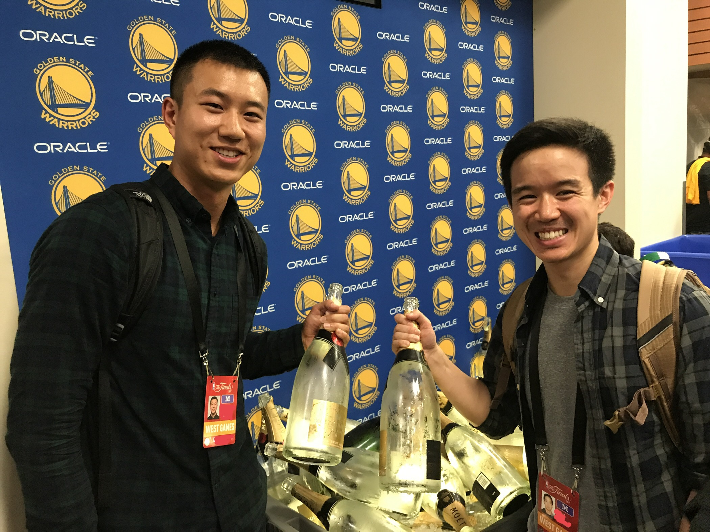
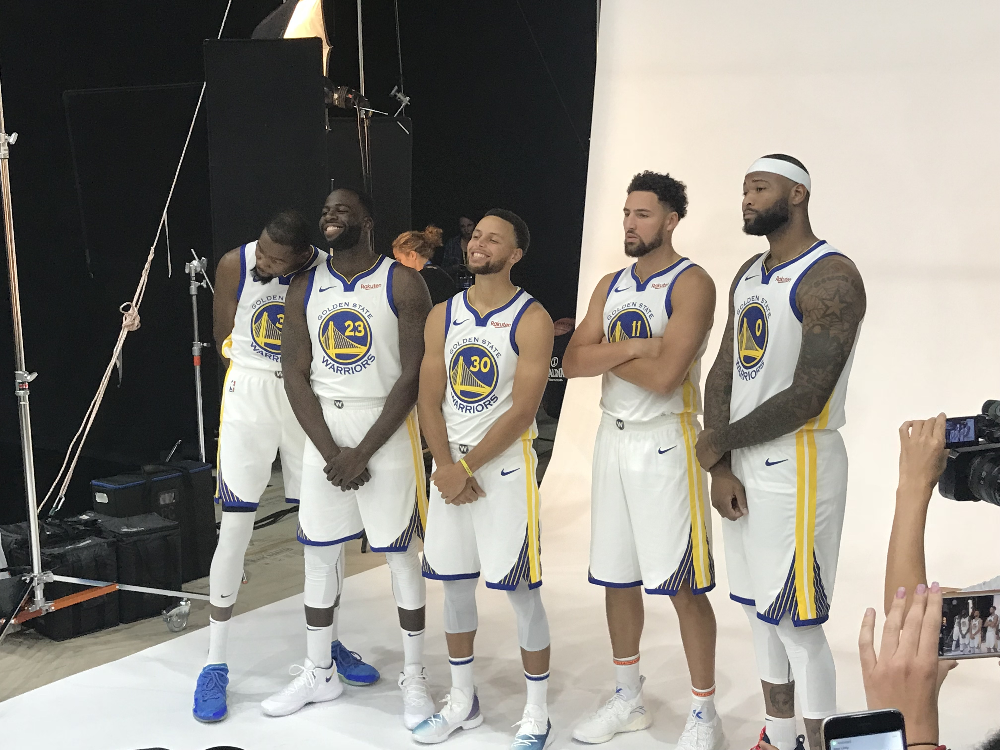
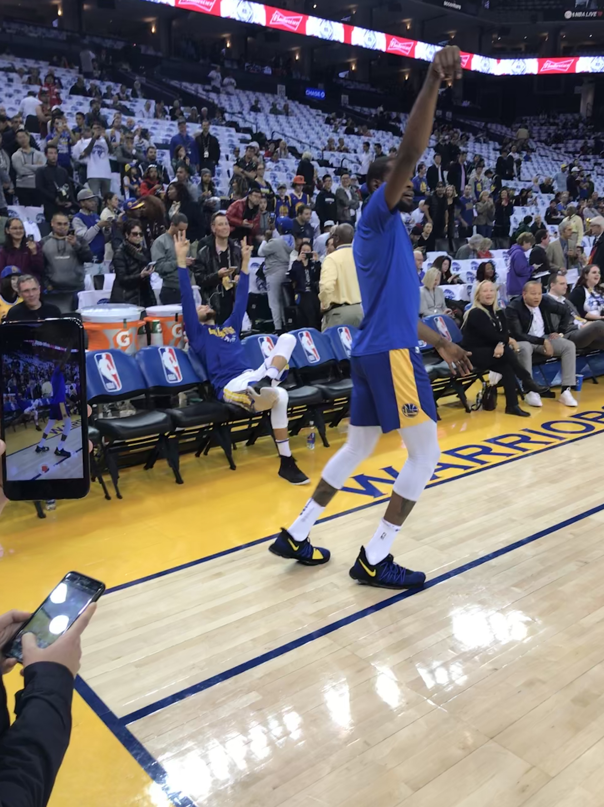
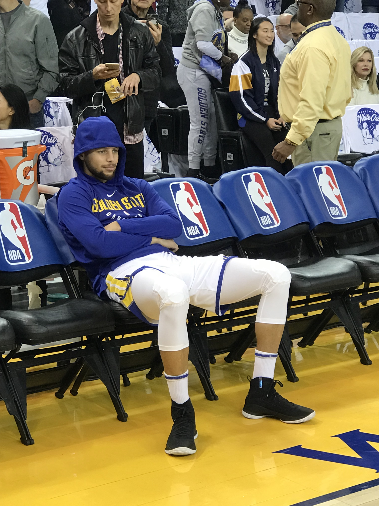

* Business Intelligence/Data Engineer with 2+ years experience.
* Currently data wrangling, data warehousing, building dashboards, and analyzing KPIs at [Ghostery](https://www.ghostery.com/).  
* Proficient in Python, R, and SQL. 
* Skilled in business, ML, stats, and programming.  
* Graduated with an M.S. in Analytics @ Georgia Tech and a B.S. in Managerial Economics @ UC Davis
* I have a strong curiosity to learn, am highly coachable, and excited to bring value to your team.
* Previously worked as a CPA/Tax Accountant for 3 years.

In my free time I enjoy playing basketball, lifting weights, cooking healthy meals, exploring national parks, and listening to Spotify non-stop. I love trying different pizza and noodle places around New York City!  

For the 2016-2019 NBA seasons I've also been lucky enough to cover one of the greatest sports teams ever, the Golden State Warriors, as an NBA reporter for Titan Sports.

<figure class="half">
    
    
</figure>
<figure class="half">
    
    
</figure>
