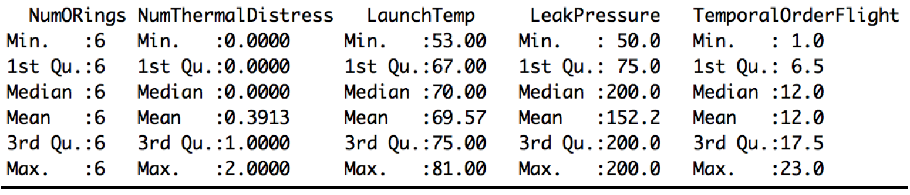
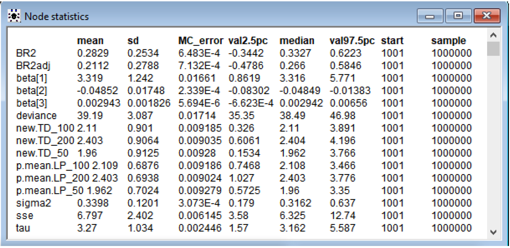
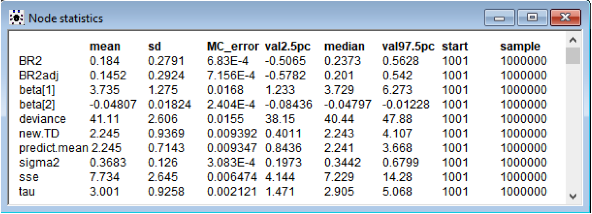

Code for this project is available on [GitHub](https://github.com/jjgong7/Bayesian-Statistics).

## Introduction:  

On January 28, 1986, space shuttle Challenger was due to takeoff from Kennedy Space Center on its tenth space mission to deploy satellites and observe Halley’s Comet among other things.  

Space shuttle Challenger contained two Solid Rocket Boosters (SRBs) that boosts the shuttle into space. Each booster has three field joints, which contains two O-rings (secondary and primary). These O-rings are 37 foot circles of special rubber that help pressure seal the gas and exhaust.  

It was an unusually cold morning that day, measuring 31 degrees Fahrenheit. Ice was visible around the launchpad and on the equipment. NASA had no experience launching at such cold temperatures with the coldest previous launch being 22 degrees warmer, at 53 degrees Fahrenheit. There was concern about the durability of the O-rings because they haven’t been tested at such low temperatures and could fail by erosion or blowby. However, there wasn't enough support to abort and they decided to continue on with the mission.  

73 seconds after liftoff, at an altitude of 9 miles, the O-ring on one of the boosters malfunctioned. The rubber O-rings had become stiff under the cold and failed to seal the joint, letting a plume of exhaust to leak out. Hot gases enveloped the cold hull of an external tank full of gases and ruptured it, causing the shuttle to be torn apart by aerodynamic forces.  

The space shuttle had no escape hatch, so it went into a free fall and disintegrated going terminal velocity over the Atlantic Ocean near Cape Canaveral, Florida. The outcome of this terrible tragedy resulted in the death of 7 crewmembers and a nearly 3 year hiatus of the space program.  

This tragedy could have possibly been prevented with enough statistical analysis using Bayesian Linear Regression by predicting the Number of O-rings experiencing thermal distress given historical data from 23 shuttle flights previous to the Challenger disaster.  

## Description of Dataset:  
The dataset is found on the UCI Machine Learning Repository. The donor of the data is David Draper of UCLA. 

* There are 23 instances with 4 attributes and a response variable. 
* The four attributes are:
    1. The number of O-rings at risk on a given flight
    2. Launch temperature (degrees Fahrenheit)
    3. Leak-check pressure (psi)
    4. Temporal order of flight.  

The Number of O-rings is always 6 and the temporal order of flight isn’t necessary since the flights are independent of each other. The data for Number of O-rings at risk on a given flight and Temporal order of flight is still listed in the dataset in OpenBUGS, but not used for the linear regression models.  

As a result, there are really only two relevant attributes:

1. The Launch Temperature (degrees F)
2. Leak-Check pressure
    * The pressure (in psi) at which safety testing for field joint leaks was performed, was available, but the relevance to the problem was unclear.  

Therefore, I will run two linear regression models: 
1. One with 3 parameters – intercept, Launch Temperature (degrees F) and Leak-Check pressure and 
2. One with 2 parameters – intercept and Launch Temperature (degrees F).  

The goal is to make a prediction of how many O-rings will experience thermal distress at 31 degrees Fahrenheit with Leak-Check pressure of 50, 100, and 200, and with temperature alone in the second model.

## Bayesian Linear Regression vs OLS Linear Regression:  
The Bayesian approach compared to OLS is that instead of maximizing the likelihood function alone, we assume prior distributions for the parameters and use Bayes theorem. Since I don’t have any estimates for the prior parameters, I will be setting normal non-informative priors on the beta coefficients and a gamma prior on the precision parameter.  

By applying Bayes theorem, we obtain the posterior distribution of the parameters, which is an estimate that depends on both the data’s likelihood function and the prior belief. Bayesian Linear Regression doesn’t find the single “best” value of the model parameters, but determines the posterior distribution for the model parameters.  

Depending on priors, Bayesian analysis is generally more accurate in small samples such as this problem with only 23 instances. With more information in the data, the priors are less influential.  

## Summary of Data:  
  

Summary of the data shows:
* The mean launch temp is 69.57 degrees Fahrenheit, which is much warmer than the temperature on that day. 
* Leak pressure is 152.2 psi on average, but it takes values of 50, 100, and 200. 
* There are 7 occurrences of O-rings experiencing thermal distress, with 5 involving 1 O-ring and 2 involving 2 O-rings.  

## Analysis:  
Both are sampled at 1,000,000 iterations and 1,000 burned.  

**With 3 parameters: Intercept, Launch Temperature (degrees F) and Leak-Check pressure**  

  

Beta[1] is intercept, beta[2] is Launch Temperature, and beta[3] is Leak-Check Pressure. From the 95% Credible Set, I can see that the intercept and launch temperature coefficients are statistically significant because the set doesn’t contain 0. Leak-Check pressure has a 95% Credible Set of (-6.623E-4, 0.00656) and barely includes 0 in the lower bound. It is possible that this coefficient isn’t significant. This Leak Pressure will be taken out in the 2 parameter model.  

The mean response of the number of O-rings experiencing thermal distress when Launch temperature = 31 degrees Fahrenheit and Leak-check pressure (psi) = 50, 100, and 200 are as follows:  

Leak-check pressure (psi) = 50, Thermal distress = 1.96, with 95% Credible Set (0.5725, 3.35)  

Leak-check pressure (psi) = 100, Thermal distress = 2.11, with 95% Credible Set (0.7468, 3.466)  

Leak-check pressure (psi) = 200, Thermal distress = 2.40, with 95% Credible Set (1.027, 3.766)  

The 95% Credible Sets for prediction (new.TD_50, 100, 200) are much larger than the mean response, as expected, because there is more error in prediction.  

Since the mean for coefficient beta[3] is 0.002943, it means that each unit of Leak-check pressure (psi) increases the number of O-rings experiencing thermal distress by 0.002943. From 50 psi to 200 psi, there is almost a .5 increase in O-rings experiencing thermal distress. A higher leak-check pressure is not better. This is a little strange and contrary to what I would believe - that checking leaks at a higher pressures should mean it’s more safe. However, this could also mean that they are expecting the rocket booster to withstand more pressure based on cargo or whatever and believe it’s necessary to test at higher pressures.  

The R-squared = 0.2829 and the adjusted R-squared = 0.2112. The R-squared is a goodness-of-fit measure and explains the variability in the data. It’s small at .2 something. A higher R-squared is better and desired, but not possible with the given data. Adjusted R-squared modifies for the number of predictors in the model. The small R-squared could make the results more skeptical. The deviance is 39.19.  

Still, it’s quite clear that regardless of the leak-check pressure, due to a very lower than normal temperature at launch of 31 degrees Fahrenheit, the chance of O-ring malfunction is very high and that the mission should have been aborted. The mean response of the number of O-rings experiencing thermal distress is around 2 for the three different values of leak-check pressure.  

**With 2 parameters: Intercept and Launch Temperature (degrees F)**  
  

Beta[1] is intercept and beta[2] is Launch Temperature. From the 95% Credible Set, I can see that the intercept and launch temperature coefficients are statistically significant because the set doesn’t contain 0.  

The mean response of the number of O-rings experiencing thermal distress when Launch temperature = 31 degrees Fahrenheit is as follows:  

Thermal distress = 2.245, with 95% Credible Set (0.8436, 3.668)  

The 95% Credible Sets for prediction (new.TD) is much larger than the mean response as expected because there is more error in prediction.  

The R-squared = 0.184 and the adjusted R-squared = 0.1452. The R-squared is a goodness-of-fit measure and explains the variability in the data. The R-squared values are much worse without Leak-check pressure as a variable. The R-squared is 0.184 vs 0.2829 and R-squared adjusted is 0.1452 vs. 0.2112. The deviance is also higher at 41.11 vs 39.19 and variance (sigma squared) is higher as well.  

Due to a very lower than normal temperature at launch of 31 degrees Fahrenheit, the chance of O-ring malfunction is very high and that the mission should be aborted.  

## Conclusion:  
In comparing the two models, the 3 parameter model with the intercept, launch temperature and leak-check pressure performs better than the 2 parameter model. The 3 parameter model explains much more of the variability in the data with the higher R-squared and R-squared adjusted value and has a slightly lower deviance. Having the leak-check pressure coefficient also explains a 0.5 variability in the number of O-rings experiencing thermal distress from 50 to 200 psi. With both models, it’s clear that with a launch temperature of 31 degrees Fahrenheit, the number of O-rings experiencing thermal distress is very high at around 2. If they performed regression using data from the 23 previous flights, they could have concluded there was a high chance of malfunction predicted and that the mission should not have been flown.

