---
title: "Unsupervised Learning"
date: 2018-06-02
tags: [unsupervised learning, python, jython]
excerpt: "Unsupervised Learning, Dimensionality Reduction, Clustering, PCA, ICA"
header:
  image: "./images/ml-unsup/unsup_header.png"
---  

Details for this project are available on [GitHub](https://github.com/jjgong7/Machine-Learning/tree/master/3%20-%20Unsupervised%20Learning%20and%20Dimensionality%20Reduction).  

## Objective:  

Six different algorithms are implemented; the first two are clustering – k-means clustering and Expectation Maximization and the last four are dimensionality reduction algorithms – PCA, ICA, Randomized Projections, and Random Forest. The experiments are split into four main parts. All algorithms are evaluated using Scikit-learn in Python.

* Part 1:
    - Applies clustering on both datasets
* Part 2:
    - Applies dimensionality reduction algorithms on both datasets
    - Reproduces clustering experiments with dimensionality reduction on both datasets
* Part 3:
    - Applies dimensionality reduction algorithms to the Faulty Plates datasets
    - Run Neural Network on the data
* Part 4:
    - Applies clustering algorithms and uses the clusters as new features for the Neural Network on the Faulty Plates dataset

## Datasets used:
**Faulty Steel Plates**
* 1,941 instances; 27 attributes; 7 labels
* Steel Plates are classified into 7 different faulty categories - Pastry, Z_Scratch, K_Scratch, Stains, Dirtiness, Bumps, and Other_Faults
* Other_Faults ~ 35%, Bumps ~ 20%, K_Scratch ~ 20%
* All features are numerical

**Breast Cancer**
* 569 instances, 31 attributes, binary label
* Features are measurements calculated from a digitized image of a breast mass
* Classifies whether a breast mass is malignant or benign
* 357 Benign, 212 Malignant
* All features are real valued

## Why are the datasets interesting?
**Faulty Steel Plates**  
Identifying faulty steel plates:
* Improve safety and reduce costs (return fees)
* Reduce amount of defective plates used and in circulation
* Applicable to evaluating other types of defective metals

**Breast Cancer**  
Identifying breast cancer:
* Breast Cancer affects about 200,000 women a year in the U.S.
* About 12% of U.S. women develop breast cancer in their lifteime
* Early identification of malignant breast mass cells using machine learning is very beneficial for prevention, treatment, and potentially saves lives.

**Algorithms Used:**
1. Clustering (k-means and EM)
2. Neural Network  

Dimensionality Reduction
3. Principal Component Analysis (PCA)
4. Independent Component Analysis (ICA)
5. Random Projections (RP)
6. Random Forest (RF)

## Part 1: Clustering
Clustering is an unsupervised learning algorithm that groups a set of observations together that are similar to each other compared to those in other groups.

K-Means:
* Takes in a parameter k, for the amount of clusters, and randomly generates k means
* K-clusters are formed based on associating each observation to the closest mean
* The least squared Euclidean distance is used for measurement
* The center of each of the clusters becomes the new mean
* These steps are iterated until convergence is reached

Expectation-Maximization:
* Iterative method using maximum likelihood to find the clusters means
* Alternates between a soft clustering (Expectation) and computing the means of a soft cluster (Maximization)
* Expectation calculates the likelihood that the observation is in a certain cluster based on the mean
* Maximization computes the means from likelihoods, using weighted averages of the data points
* Each step maximizes the likelihood of the distribution until convergence.  

**To find a good k:**
* K-means:
    - Sum of Squared Distances within clusters vs # of clusters
        + Elbow point where SSE decreases sharply, can be used to determine k
* Expectation-Maximization:
    -  Log-likelihood 
        +  Calculates the likelihood that the data is to be generated by the parameters estimated
        +  Higher likelihood means that the data is more likely to be generated by the estimated parameters (tradeoff with overfitting)
* Both:
    - Silhouette Score:
        + Takes into account both intra and inter cluster distances
            * Explains how similar an observation is to its own cluster compared to other clusters.
            * Range is from -1 to 1
                - 1 best value meaning it matches well with its own cluster and far from other clusters
                - 0 indicates overlapping clusters  

Evaluation of clusters:
1. Accuracy
    * Measures the percentage of the predicted label matching with the true label
2. Adjusted Mutual Information Score
    * Measures the similarity between two labels of the same data between two clusters
    * Takes into account chance
    * Range is from 0 to 1
        - 1 means that the labels agree

**Faulty Steel Plates: Clustering**
#### Evaluation: 
<!-- 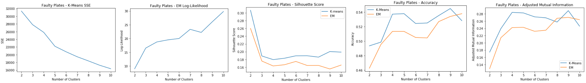   -->

* K-means: SSE
    - Elbow at k=9
* EM: Log-Likelihood
    - Spike at k=7 and k=9
* Silhouette Score
    - Spike at k=9 for k-means, but dip for EM
    - k=6 experiences a spike for both clustering methods
* Accuracy and Adjusted Mutual Information
    - Peaks at k=9 for both

k=7 makes sense since there are seven different labels for the faulty steel plates datasets. k=9 also makes sense because there is an "other" category that could contain two distinct faulty plates labeled as "other". 

**Breast Cancer: Clustering**
#### Evaluation:
<!-- 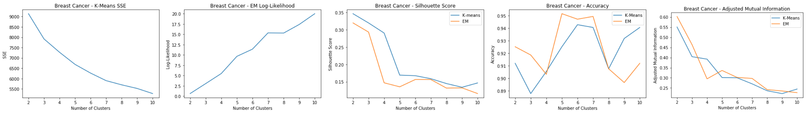   -->

* K-means: SSE
    - Elbow at k=7
* EM: Log-Likelihood
    - Spike at k=7
* Silhouette Score
    - Spike at k=7 for both
* Accuracy and Adjusted Mutual Information
    - Accuracy highest at k=7 and AdjMI leveled out somewhat at k=7

k=7 can make sense because there could possibly be seven different types of breast mass cells that could be identified as either malignant or benign.

## Part 2. Dimensionality Reduction and Clustering:  
### Principal Component Analysis (PCA):  
* Principal component analysis uses orthogonal transformation and linear combination to identify important components that maximizes variance 
* PCA is used to reduce a large set of features into a subset that still contains most of the information
* To determine dimensional reduction for PCA, examine:
    - The variance explained by the components
    - Distribution of eigenvalues
    - Elbow method can be used to evaluate the number of principal components to choose

**Faulty Steel Plates: PCA**  

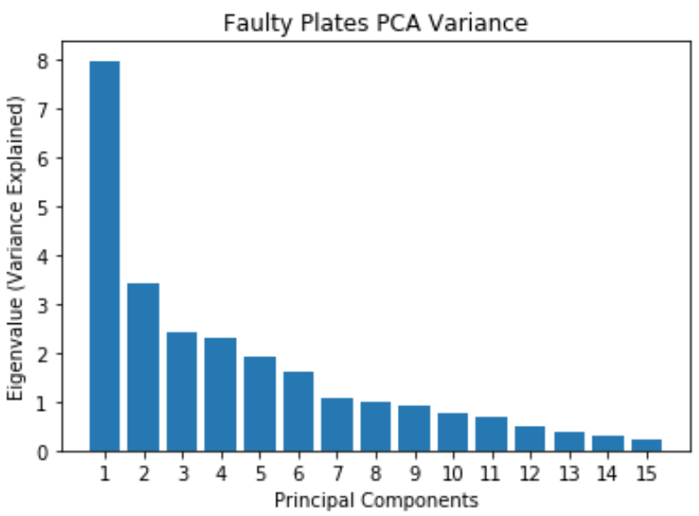  
* Most of the variance can be explained by the first 12 principal components
* Original dataset has 27 features, now reduced to 12 principal components   

**Faulty Steel Plates: PCA Clustering**  

<!-- 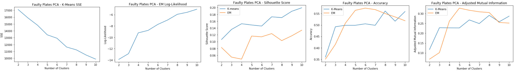  
 -->
 

Using 12 principal components for clustering:
* K-means: SSE
    - Slight elbow at k=7
    - Reduces SSE from 24,000 to 14,000, does well reducing inter cluster error
* EM: Log-Likelihood
    - Slight spike at k=7
* Silhouette Score
    - Low silhouette score for EM shows that it doesn't do as well as k-means in separating the clusters. Possible overlapping clusters.
    - Slight spike for k=7 for both
* Accuracy and Adjusted Mutual Information
    - Shows that EM has relatively good prediction accuracy compared to k-means

Good cluster at k=7

**Breast Cancer: PCA**  

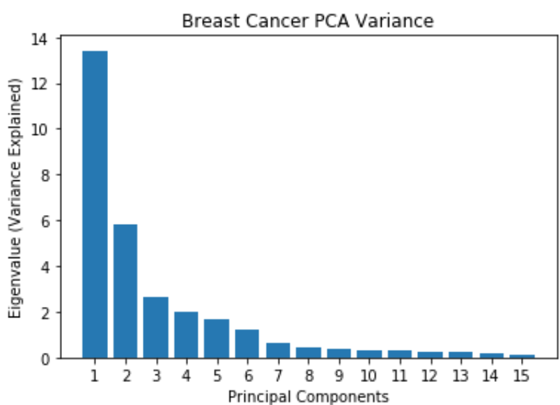  
* Most of the variance is explained by the first 7 principal components
* Original dataset has 30 features, now reduced to 7 principal components  

**Breast Cancer: PCA Clustering**  

<!-- 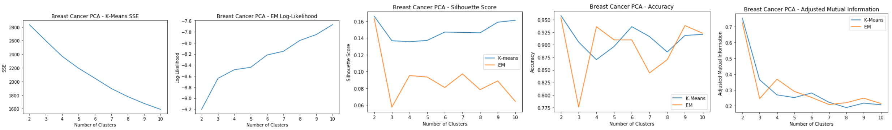   -->

Using 7 principal components for clustering:
* K-means: SSE
    - Elbow method doesn't show a clear dip
    - SSE shows a reduction of 1/3 from original clustering error, which means PCA reduces within cluster error, but does worse intra-cluster
* EM: Log-Likelihood
    - Slight spike at k=6
* Silhouette Score
    - Low silhouette score for EM shows that it doesn't do as well as k-means in separating the clusters
    - Slight spike for k=6 for k-means
* Accuracy and Adjusted Mutual Information
    - PCA clustering doesn't do as well accuracy wise compared to regular clustering

Good cluster at k=6  

### Independent Component Analysis (ICA):  
* Independent component analysis tries to decompose data into independent non-Gaussian components
* Maximizes mutual information between the original data and the independent components
* The sub-components are assumed to be non-Gaussian and independent from each other
Evaluation:
* The number of independent components to choose can be evaluated by their kurtosis values since kurtosis measures gaussianity and ICA tries to maximize non-gaussianity
* A kurtosis near 3 is gaussian, so it's best to find a kurtosis that has the highest absolute value of the mean of the kurtosis

**Faulty Steel Plates: ICA**  

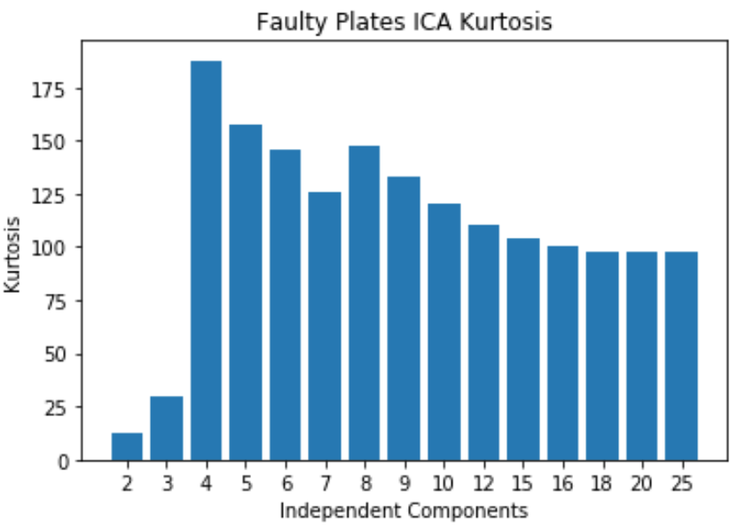  
* Kurtosis peaks at 4
* Original dataset has 27 features and now 4 indpenedent components are selected. A huge reduction in dimensionality   

**Faulty Steel Plates: ICA Clustering**  

<!-- 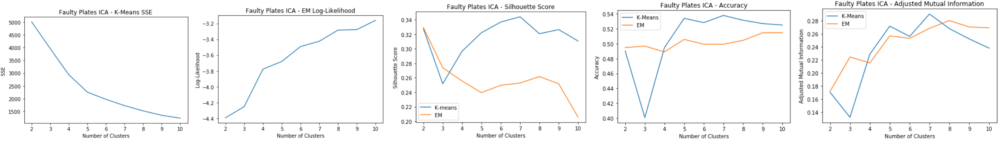  --> 

Using 4 independent components for clustering:
* K-means: SSE
    - Elbow at k=5
    - The within cluster SSE decreases significantly compared to the original dataset
* EM: Log-Likelihood
    - Slight spike at k=7
* Silhouette Score
    - Low silhouette score for EM shows that it doesn't do as well as k-means in separating the clusters. Possible overlapping clusters.
    - Slight spike for k=7 for both
* Accuracy and Adjusted Mutual Information
    - Shows that EM has relatively good prediction accuracy compared to k-means
    - Peaks at k=7 for both
Good cluster at k=7

**Breast Cancer: ICA**  

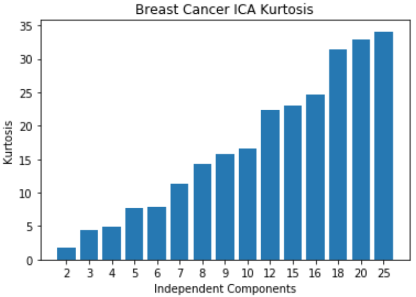  
* Kurtosis keeps increasing, meaning non-gaussianity increases as the number of independent components increases
* Original dataset has 30 features, but 25 independent components is enough since it starts leveling off 

**Breast Cancer: ICA Clustering**  

<!-- 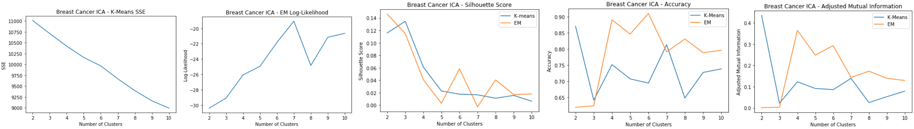 -->  

Using 25 independent components for clustering:
* K-means: SSE
    - Elbow method doesn't show a clear dip
    - SSE decreases from the original clustering
* EM: Log-Likelihood
    - Clear peak at k=6 and 8
* Silhouette Score
    - Produces similar cluster distances for k-means and EM
    - Slight spike for k=6 for k-means
* Accuracy and Adjusted Mutual Information
    - ICA clustering has less accuracy than PCA and the original dataset
    - EM has highest accuracy at k=7
    - K-means has peak at k=7
Good cluster at k=6 and k=7

### Random Projection (RP):  
* Reduces dimensions randomly using a Gaussian distribution
* Benefits of random projections that it's computationally efficient and works well on low dimensions
* May perform pretty poorly based on one random generation, so 10 iterations are run and averaged for evaluation.
* Goal of random projection:
    - Average Pairwise Distance Correlation: preserve the pairwise distances between any two samples of the dataset, so we want to maximize the variance and average pairwise distance correlation
    - Average Reconstruction Error: minimize the reconstruction error, which is the squared distance between the original data and the estimate

**Faulty Steel Plates: RP**  

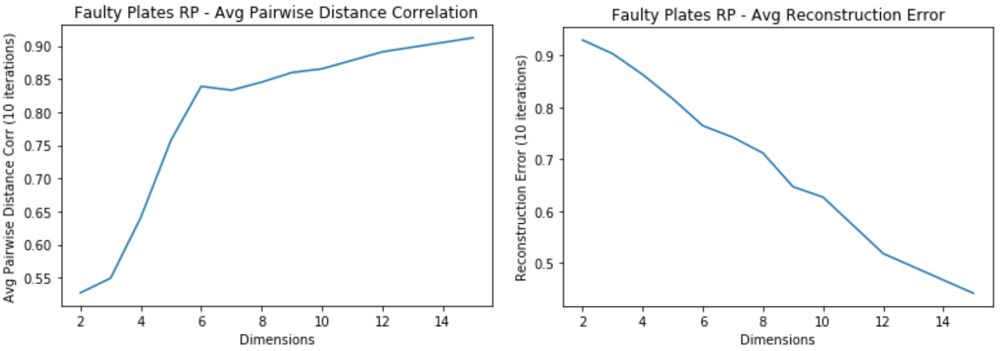  
* Average Pairwise Distance Correlation starts leveling off around 7 dimensions
* The Average Reconstruction error keeps decreasing for higher dimensions
    - Tradeoff between overfitting and computational time

**Faulty Steel Plates: RP Clustering**  

<!-- 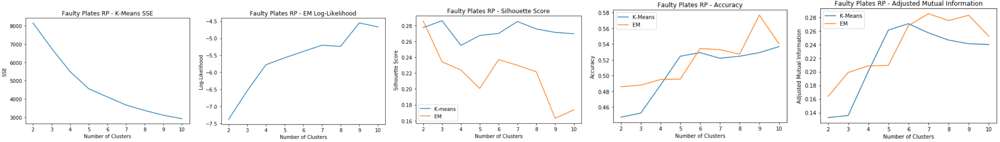 -->  

Using 7 dimensions for clustering:
* K-means: SSE
    - Slight elbow at k=5
    - The within cluster SSE decreases significantly compared to the original dataset
* EM: Log-Likelihood
    - Slight spike at k=9
* Silhouette Score
    - Spike at k=7 for both
* Accuracy and Adjusted Mutual Information
    - Accuracy for EM shows that k=9 is a good cluster
    - Accuracy for k-means shows that k=7 is a good cluster
    - Accuracy for RP EM is the highest so far for all dim algorithms at k=9  

Good cluster at k=7

**Breast Cancer: RP**  

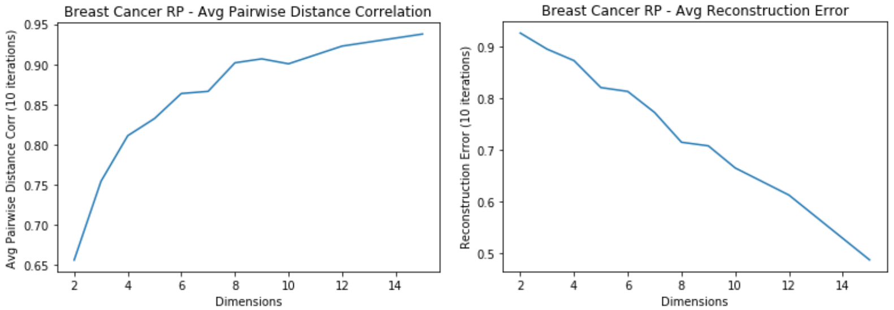  
* Average Pairwise Distance Correlation starts levling off around 7 dimensions
* Average reconstruction error keeps decreasing for higher dimensions

**Breast Cancer: RP Clustering**  

<!-- 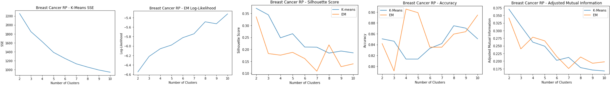 -->  

Using 7 dimensions for clustering:
* K-means: SSE
    - Elbow at k=5
    - SSE decreases from the original clustering due to dim reduction
* EM: Log-Likelihood
    - Peak around k=8
* Silhouette Score
    - On average has improved for k-means from the original clustering
    - Peak at k=8 for EM
    - Peak at k=5 for k-means
* Accuracy and Adjusted Mutual Information
    - Accuracy is much lower than the original dataset
    - Peaks at k=5  
 
Good cluster at k=5

### Random Forest (RF):  
* Strong learner that is an ensemble of weak learner decision trees
* Feature selection for Random Forest is based on feature importance
* Feature importance is measured by Gini importance, which is the total decrease in node impurity reaching that node averaged over all trees of the ensemble. 
    - The higher the Gini importance value, the more important the feature
    - Elbow method used to evaluate the number of features to use

**Faulty Steel Plates: RF**  

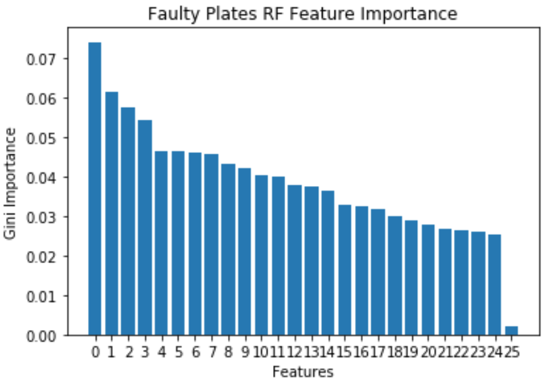  
* Faulty Plates dataset has a lot of important features, and has a sharp decline at 25 features.
* Decrease in dimensionality from 27 to 24

**Faulty Steel Plates: RF Clustering**  

<!-- 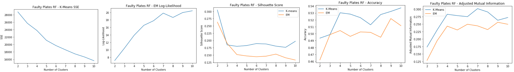 -->  

Using 25 dimensions for clustering:
* K-means: SSE
    - Doesn't really have an elbow point
    - Doesn't decrease within cluster error in k-means as much as the other algorithms
* EM: Log-Likelihood
    - Peak at k=7
* Silhouette Score
    - k=7 for k-means
    - k=8 for EM
* Accuracy and Adjusted Mutual Information
    - Accuracy shows that k=9 and k=4
Good clusters at k=4 and k=9

**Breast Cancer: RF**  

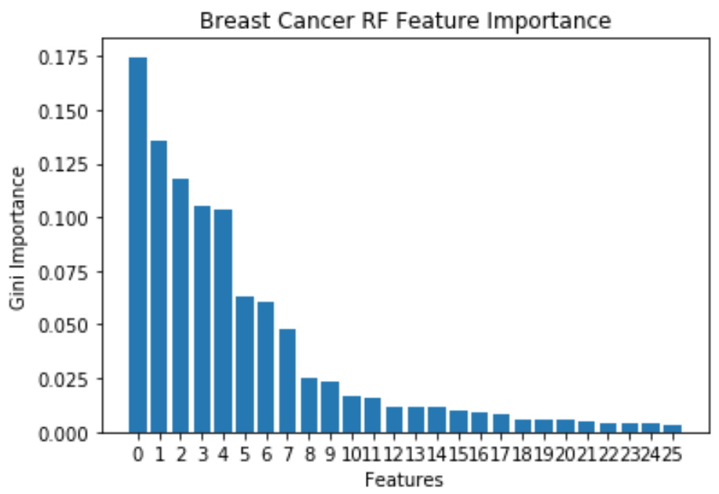  
* 10 important features, because Gini Importance starts to level off after that
* Features reduced from 30 to 10 using Random Forest

**Breast Cancer: RF Clustering**  

<!-- 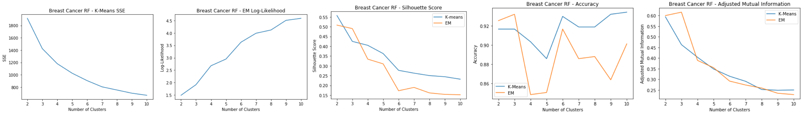 -->  

Using 10 dimensions for clustering:
* K-means: SSE
    - Elbow at k=7
* EM: Log-Likelihood
    - Leveling out around k=9
* Silhouette Score
    - For both shows a consistent decrease
    - As the number of clusters get larger, the cluster distances for both start decreasing, hard to tell what a good k is
* Accuracy and Adjusted Mutual Information
    - Accuracy shows that k=3, 6, and 10 are good clusters
Good clusters at k=3, 6, and 10

## Part 3: Dimensionality Reduction Algorithms with Neural Network  
* The faulty plates dataset is used to evaluate the dimensional reduction algorithms as inputs with the Neural Network compared to the baseline Neural Network
* The baseline for the Neural Network is a 71.9% with hyperparameters of learning rate = 0.1, momentum = 0.3, and one hidden layer with 14 neurons.  

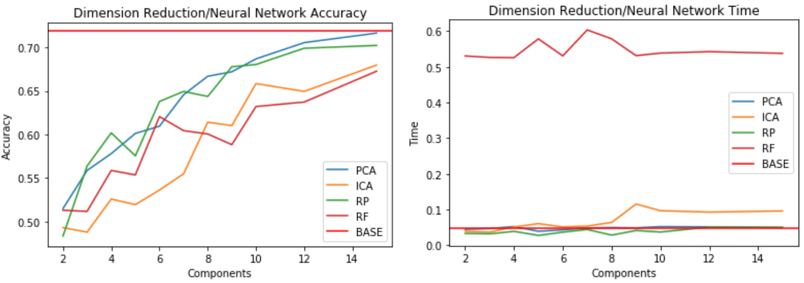  
* Compares accuracy of different reduction algorithms on the Neural Network to the benchmark Neural Network
* Accuracy shows that PCA and Random Projection perform well on the NN at higher components
* With around 15 components, the accuracy is close to the benchmark
* Dimensions are much lower than the original 27 features, so it simplifies model complexity
* Compute times are similar between the benchmark, random projection, and PCA.  
## Part 4: Cluster Features with Neural Network  
* Clusters are used as features for the neural network
* Baseline is the same as above  

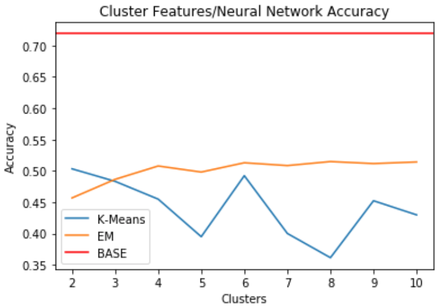  
* When clusters are used as features, it doesn't do a good job of predicting the labels
* Performs far below benchmark accuracy of 71.9%
* Seems like accuracy is best for EM and k-means when k=6

## Conclusion:
The dimensions for each of the components in the clustering algorithms in Part 2 along with computational times were as follows:  

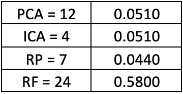  
* Computational times were similar for PCA and ICA based on the dimensions
* Random preojection did best in computational time and in lower dimensions
* Random Forest used as feature selection takes too much computational time

Most of the dimensionality reductions do help in reducing SSE within clusters. PCA and ICA do not increase the intra-cluster distance, but Random Projection and Random Forest does.

