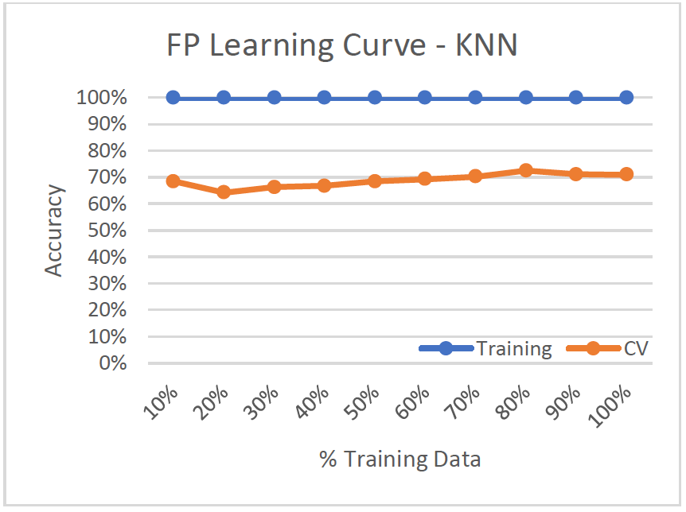

<!-- # Supervised Learning -->
Analyze two datasets using five different supervised learning algorithms. Weka, a suite of machine learning software written in Java, is used for analysis.

## Datasets used:
**Faulty Steel Plates**
* 1,941 instances; 27 attributes; 7 labels
* Steel Plates are classified into 7 different faulty categories - Pastry, Z_Scratch, K_Scratch, Stains, Dirtiness, Bumps, and Other_Faults
* Other_Faults ~ 35%, Bumps ~ 20%, K_Scratch ~ 20%
* All features are numerical

**Phishing Websites**
* 11,055 instances, 30 attributes, binary label
* Websites are classified as a phishing website (1) or not a phishing website (-1)
* Not Phishing ~ 44%, Phishing ~ 56%
* All data is nominal (-1, 0, or 1)

## Why are the datasets interesting?
**Faulty Steel Plates**  
Identifying faulty steel plates can:
* Improve safety and reduce costs (return fees)
* Reduce amount of defective plates used and in circulation
* Applicable to evaluating other types of defective metals

**Phishing Websites**  
Identifying phishing websites can:
* Improve online security
* Prevents identity theft, credit card theft, etc.

## Analysis Steps:
* 80% training data, 20% test data
* 10-fold cross validation used on training set to help generalize and avoid overfitting
* Accuracy rate for training and cross-validation is averaged accross folds
* Training set (build the model), validation set (tune the hyperparameters and pick a model), and held-out test set (final performance of the chosen model)
* Two learning curves graphed
    - Training and Validation Accuracy vs. Training Size (Learning Curve)
        + Used to evaluate bias and variance. Training size in increments of 10%
    - Training and Validation Accuracy vs. Range of Single Hyperparameter Value (Model Evaluation)
        + Performance of training and cv accuracy vary for different inputs of a single hyperparameter

**Supervised Learning Algorithms:**
1. Decision Tree
2. Boosting
3. Neural Network
4. Support Vector Machines
5. k-Nearest Neighbors (kNN)  
  
---

### 1. Decision Tree:
This is a top down learning algorithm that splits the best attributes (decision nodes) based on information gain. The branches are the outcomes of the binary splits (≥,≤ or T, F) and the leaf nodes represent a classifying label.  
  
Hyperparameters:  
* Pruning (True, False)
    - Pruning serves to simplify the tree, making it easier to understand the results and avoid risk of overfitting the training data.
* Confidence Factor (Default = 0.25)
    - Lower values incur more pruning
    

**Faulty Steel Plates**
#### Learning Curve  
  
* High Variance/Low Bias (Overfitting)
* Training accuracy ~93% while validation accuracy ~70%

#### Model Complexity
  
* Adjusted confidence factor from 0.1 to 0.5
* With confidence factor = 0.5, tree size is 432, and has second highest cv-accuracy after the unpruned tree. 

**Phishing Websites**
#### Learning Curve  
  
* Low Variance/Low Bias (Good Model)
* Accuracy is high for both training and validation set
* Classifies well even with low training data (~10%) 

#### Model Complexity  
  
* With confidence factor = 0.2, tree size is 257 with 129 leaves, CV-accuracy is 73.32%. 

Phishing websites has a much better classification accuracy than faulty plates. This can be because faulty plates dataset has seven different class labels, while phishing websites only has a binary label.

### 2. Boosting:  
Boosting is an ensemble learning method that incrementally builds the model by placing more weight on the misclassified data. It basically turns a set of weak learners, which always do better than chance, into a single strong learner. In Weka, the boosting algorithm is called AdaBoostM1.  

Hyperparameters:
* Defaults:
    - Base Classifier (J48 Decision Tree)
    - Pruned Tree
    - 0.25 Confidence Factor
* Number of Iterations:
    - Higher iterations use more weak learners
    - 10 to 50

**Faulty Steel Plates**
#### Learning Curve  
  
* High Variance/Low Bias (Overfitting)
* 100% accuracy on training set while validation set only has around 71% accuracy, so it doesn't generalize well

#### Model Complexity
  
* Test iterations from 10 to 50 to improve weak learners
* Best cv-accuracy at 79.70% when iterations = 40. Tree size is 293 with 147 leaves.

**Phishing Websites**
#### Learning Curve  
  
* Low Variance/Low Bias (Good model)
* Training and validation data both above ~92%

#### Model Complexity  
  
* Test iterations from 10 to 50 to improve weak learners
* Best cv-accuracy at 96.96% when iterations = 30. Tree size is lowest at 19.

For the learning curves, both datasets improve a lot with more training data:
* Faulty Plates from 64% to 79%
* Phishing Websites from 92.5% to 97.04%

This shows with more training data, the model is able to generalize better and achieve a lower variance/bias. Boosting does better than the original decision tree because it improves upon our decision tree base classifier by turning weak learners into a set of strong learners.

### 3. Neural Network:  
A neural network tries to mimic the brain in mapping inputs to outputs. Weka uses MultiLayerPerceptron - a network of perceptions. 

Hyperparameters:
* Hidden Layers
    - Default of one hidden layer
* Number of Neurons
    - Default (attributes + classes)/2 neurons in each layer.
* Weights (Learning Rate, Momentum)
    - Weights for the perceptrons are learned from the training set and updated via “backpropagation”.
    - The change in weight is the learning rate times the gradient plus the previous change in weight times the momentum.

**Faulty Steel Plates**
#### Learning Curve  
  
What this means is

#### Model Complexity
  
What this mean  

**Phishing Websites**
#### Learning Curve  
  
What this mean  

#### Model Complexity  
  
What this mean

### 4. Support Vector Machines (SVM):  
Support Vector Machines uses hyperplanes to maximize the margins between the different classes. The larger the distance between the hyperplanes, the better the generalization and separation of classes. In Weka, LibSVM is the most popular and robust SVM algorithm. LibSVM uses one vs one classification, where each different pair of labels has a separately trained classifier.  

Hyperparameters:  
* Kernels
    - Linear, Polynomial, Radial Basis Function, Sigmoid

**Faulty Steel Plates**
#### Learning Curve  
  
What this means is

#### Model Complexity
  
What this mean  

**Phishing Websites**
#### Learning Curve  
  
What this mean  

#### Model Complexity  
  
What this mean

### 5. k-Nearest Neighbors (kNN):  
The k-Nearest Neighbor algorithm outputs a classification based on the majority of the number of neighbors. This is an instance based, lazy learner, which means it does nothing until you have to make a prediction. In Weka, IBK is used.  

Hyperparameters:  
* Number of Nearest Neighbors  
    - Default: 1 Nearest Neighbor
* Distance Function
    - Default: Euclidean Distance

**Faulty Steel Plates**
#### Learning Curve  
  
What this means is

#### Model Complexity
  
What this mean  

**Phishing Websites**
#### Learning Curve  
  
What this mean  

#### Model Complexity  
  
What this mean

<!--    -->

<!-- #### Learning Curve
**Faulty Steel Plates**
**Phishing Websites**

#### Model Complexity
**Faulty Steel Plates**
**Phishing Websites** -->

