## Objective:  
Details for this project are available on [GitHub](https://github.com/jjgong7/NHANES-Practicum).

The objective of the practicum is to identify the prevalence and risk factors of hospital utilization and major diseases over time using publicly reported qualitative and quantitative data. To help answer this objective, I will explore five main questions:

1.  What factors predict the likelihood of a patient utilizing hospital resources?
2.  Are there different risk factors associated with different clinical categories or clusters of patients?
3.  How can the prevalence of major diseases and risk factors be depicted visually to policy makers?
4.  The prevalence of certain diseases has been thought to be increasing over time. As disease prevalence increases, has the use of hospital resources also increased? Additionally, what socio-economic factors are associated with increases in disease prevalence?
5.  Has the prevalence of undiagnosed conditions increased in rural populations over time, compared to non-rural populations? 

This project is split into six parts:  

1. Part one:
    * Identify the risk factors and prevalence of hospital utilization.  
2. Parts two to five:
    * Identify the risk factors and prevalence of four major diseases – Heart Disease, Cancer, Chronic Lung Disease and Diabetes.  
3. Part six:
    * Identify the prevalence of undiagnosed Diabetes, where BMI > 30.

## Introduction to NHANES  
“The National Health and Nutrition Examination Survey (NHANES) is a program of studies designed to assess the health and nutritional status of adults and children in the United States. The survey is unique in that it combines interviews and physical examinations. NHANES is a major program of the National Center for Health Statistics (NCHS). NCHS is part of the Centers for Disease Control and Prevention (CDC) and has the responsibility for producing vital and health statistics for the Nation.  

The NHANES program began in the early 1960s and has been conducted as a series of surveys focusing on different population groups or health topics. In 1999, the survey became a continuous program that has a changing focus on a variety of health and nutrition measurements to meet emerging needs. The survey examines a nationally representative sample of about 5,000 persons each year. These persons are located in counties across the country, 15 of which are visited each year.

The NHANES interview includes demographic, socioeconomic, dietary, and health-related questions. The examination component consists of medical, dental, and physiological measurements, as well as laboratory tests administered by highly trained medical personnel. Findings from this survey will be used to determine the prevalence of major diseases and risk factors for diseases.  

## Dataset
The data is presented in 2 year groups from 1999 to 2016 (1999-2000, 2001-2002, etc.). The 18-year data consists of 1,222 XPT files for about ~3.2 GB. Each 2-year span includes information about demographic, dietary, examination, laboratory, and questionnaire data. An individual in each 2-year span has a unique id labeled ‘SEQN’.  

## Data Cleaning and Processing
The following data files are used for this project:
1.  Demographics Data 
2.  Dietary Data: Dietary Interview for First Day
3.  Examination Data: Blood Pressure Measurement, Total Cholesterol, LDL – Cholesterol, HDL – Cholesterol, Body Measures
4.  Questionnaire Data: Alcohol Use, Blood Pressure, Diabetes, Health Insurance, Hospital Utilization, Medical Conditions, Physical Activity, Respiratory Health, Smoking, Household Smoking, Weight History  

### a. Data Cleaning
Data cleaning and processing are performed in Python using Jupyter notebooks. The files were converted from XPT to CSV format into the appropriate folders. Features were renamed and values were mapped to maintain consistency across the years. Records with values that were missing, “Refused”, or “Don’t Know” were removed since most of it consisted of less than 10% of the data. The cleaned data is uploaded to a local NoSQL (MongoDB) database. 
  

### b. Data Processing
For hospital utilization and major disease analysis, an inner join was performed on the IDs for the appropriate data files. One-hot encoding was performed on categorical variables since Scikit-learn’s Random Forest requires it. Labels for each analysis part was remapped as 1 indicating the minority and 0 indicating the majority class. This is reversed from the default in NHANES (0-Yes, 1-No). The collections for analysis are uploaded to a local uploaded to a local NoSQL (MongoDB) database as well.   

## Algorithms Used
**Random Forest:**
This is a supervised learning ensemble method that can be used for classification and regression. I will be using it for classification. Random forests are composed of multiple decisions trees with randomly selected subsets of features for each tree. It produces an output of the majority vote of the classes. Random forests use bagging to train each decision tree, which means it selects a random sample of about 2/3 of the training data with replacement and then uses the remaining 1/3 data, the Out-Of-Bag, to produce a generalization error. Bagging or bootstrap aggregating performs better since it’s able to decrease the variance of the model, without increasing bias. The features are split via Gini importance, which is computed as the (normalized) total reduction of the criterion brought by that feature. 

The benefits of random forests are that it corrects for decision trees’ overfitting to the training set, features don’t have to be scaled, it can handle missing values, and it gives good indication of feature importance. Scikit-learn in Python is used for analysis and to get the feature importance.

The following hyperparameters are tuned for the Random Forest algorithm via GridSearchCV:
1.  n_estimators: The number of trees in the forest 
2.  max_features: The number of features to consider at each split
3.  max_depth: Maximum depth of the tree
4.  criterion: Function to measure split (Gini)
5.  class_weight: Weights associated with the classes (Imbalanced class)

**XGBoost:** 
This is a supervised algorithm that has been popular among Kaggle competitions. XGBoost stands for eXtreme Gradient Boosting and implements a gradient boosted decision tree algorithm for classification or regression. Gradient Boosting uses weighting to convert weak learners (ones that do slightly better than chance) into a strong learner. Errors in the previous trees are thus reduced. Boosting also makes use of trees with fewer splits to prevent overfitting.

The benefits also include model performance, execution speed, handle missing values, and the ability to provide feature importance. Scikit-learn and XGBoost Classifier in Python is used for analysis and to get the feature importance.  

The following hyperparameters are tuned for the XGBoost algorithm via GridSearchCV:
1.  n_estimators: The number of trees in the forest
2.  max_depth: Maximum depth of tree
3.  subsample: Subsample ratio of the training instances (prevent overfitting)
4.  colsample_bytree: Subsampling ratio of columns when constructing each tree
5.  scale_pos_weight: Control the balance of positive and negative weights, useful for unbalanced classes.
6.  learning_rate: Step size shrinkage used in updates to prevent overfitting.

## Analysis
The analysis for parts one through five have very similar procedures:
1.  Data is retrieved from the local MongoDB. 
2.  Exploratory Data Analysis is performed. 
    * A count plot is created for categorical features to see the distribution of categories and a box plot for numerical data to identify quartiles, variability, and outliers. Class distribution is plotted overall and across the 18 years to identify any trends. 
    * A Pearson’s Coefficient Correlation plot is created for numerical data - primarily dietary data, cholesterol, and blood pressure, to show the correlation of variables and remove any highly correlated variables (measuring the same factor in different scale)
3.  Data is split into training and test sets 80% and 20%, respectively, and stratified across years.
4.  Data is Upsampled (SMOTE) and Downsampled (Tomek Links). Since we are working with health data, the class labels are highly imbalanced and up and down sampling is performed to see if models can be better fitted.  
    * SMOTE, Synthetic Minority Over-sampling Technique, is a common up sampling technique that considers its k-nearest neighbors and the current point and creates a synthetic data point using features between them.
    * Tomek links works by removing overlap between classes. Majority class links are removed until all minimally distanced nearest pairs are of the same class. This puts kind of a buffer, or border, between the classes. This creates less data overall. 
    * Imbalanced-learn in Python is used for the sampling.
5.  Unnecessary features are removed such as MEC and Dietary 18 Year weights along with years.
6.  A filtering method for feature selection is performed. 
    * Chi-2 analysis is performed to get a sense of the important features (Risk Factors). However, in this analysis, dietary information with high values are weighted heavily. 
7.  Random Forest Analysis:  
    * The regular, Upsampled, and Downsampled data are all used.
    * A parameter grid is defined for GridSearchCV for hyperparameter tuning of the hyperparameters stated above.  
    * The best hyperparameters are selected for the Regular, Upsampled, and Downsampled datasets.  
    * Random Forest Classifiers are set using the best parameters and fit using the data.  
    * Feature importance plot is generated  
    * Testing Metrics: Test Data is used for Evaluation  
        * Confusion Matrix
        * Precision and Recall
        * F1-Score (Main evaluation metric used)
            - The F1 score is the harmonic mean of precision and recall: 2TP/(2TP+FP+FN).
        * ROC AUC Scores
    * Since classifiers are classifying based on probability over a certain amount (0.5 default), different probabilities are iterated over to see if it would produce better f1-scores. A box plot is generated for each cutoff value. Most of the time, the optimal cutoff is still 0.5. The adjusted cutoff value is then compared to the 0.5 cutoff.
8.  XGBoost Analysis:  
    * The regular, Upsampled, and Downsampled data are all used.  
    * A parameter grid is defined for GridSearchCV for hyperparameter tuning of the hyperparameters stated above.  
    * The best hyperparameters are selected for the Regular, Upsampled, and Downsampled datasets.  
    * XGBoost Classifiers are set using the best parameters and fit using the data.  
    * Testing Metrics: Test Data is used for Evaluation  
        * Confusion Matrix
        * Precision and Recall  
        * F1-Score (Main evaluation metric used)  
            - The F1 score is the harmonic mean of precision and recall: 2TP/(2TP+FP+FN).  
        * ROC AUC Scores
    * Feature importance plot is generated. XGBoost has two different feature importance measurements  
        * One is based on scoring feature of f1-score and another feature importance.
    * XGBoost is compared to Random Forest Analysis
9.  Identifying the Risk Factors
    * Risk factors are identified by feature importance from Random Forest and XGBoost and also feature selection using Chi-2 analysis. The top 10 feature importance are extracted from the Chi-2 analysis, (Regular, Upsample, Downsample) from Random Forest feature importance, XGBoost F1-score importance, and XGBoost feature importance. The top ten for each are weighted 0.025, .15, .10, and 0.075, respectively, to get the overall feature importance for identifying risk factors.
        * 0.025 x [Chi-2] + .15 [Reg RF + Up RF + Down RF] + .10 [Reg XGB F1 + Up XGB F1 + Down XGB F1] + 0.075 [Reg XGB FI + Up XGB FI + Down XGB FI]
        * Weights add up to 1: 0.025 + 3 x .15 + 3 x .10 + 3 x 0.075 = 1 

## Data Visualization: Prevalence of Major Diseases and Risk Factors over time  
Data visualization (ggplot2) was performed in R. The survey library was used to take into account the complex survey design of NHANES. Error box plots with confidence intervals were generated to show the prevalence of major diseases based on risk factors and prevalence of major diseases over time.  

### Part 1: Hospital Utilization
To predict the likelihood of hospital utilization, the label ‘HUQ050’ is used in the HUQ – Hospital Utilization file. This label indicates the number of times an individual received healthcare over the past year. 

* Initially five classes from 0 (No Hospital Utilization) to 5 (Thirteen or more times received healthcare). 
* There were too many classes, so I mapped the classes to 0 [Received Healthcare (Majority Class)] and 1 [Didn’t Receive Healthcare (Minority Class)]. 
* There are 64,583 records with 52 features and ~14% are in the minority class (Didn’t Receive Healthcare).

**Random Forest:**  

Hyperparameters:
* Class\_weight hyperparameter was heavily weighted towards the minority class {0: 0.2, 1: 0.8} for the regular and downsampled data. 
* The upsampled data required a larger max\_depth at 15, since it has more balanced data and so class\_weight = ‘balanced’. 

F1 Score:
* Regular data produced the best F1 Score on minority class (No Hospital Utilization)
    - F1 Score: 0.50
    - Precision: 0.45
        + 0.45 selected items are relevant
    - Recall: 0.55
        + 0.55 relevant items are selected 

The output of feature importance for Random Forest (Left) and XGBoost (Right):  
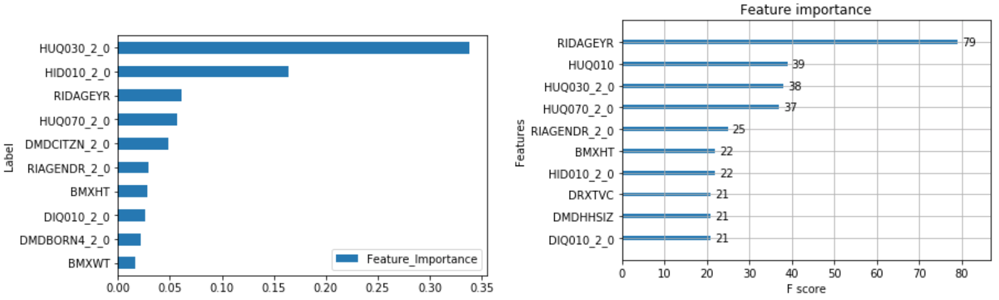  

**XGBoost:**  

Hyperparameters:
* Scale\_pos\_weight hyperparameter was weighted towards the minority class by 3 for the regular and downsampled data.
* The upsampled data required a larger max\_depth at 4 compared to 2, since it has more balanced data and so scale\_pos\_weight was also less at 2.
* The max depth is much less than random forest.

F1 Score:
* Regular data produced the best F1 Score on minority class (No Hospital Utilization)
    - F1 Score: 0.51
    - Precision: 0.47
    - Recall: 0.55

**XGBoost versus Random Forest:**
* XGBoost improved F1 score by 0.01 for both classes, and improved precision by 0.02 for the minority class
* XGBoost outperforms random forest

**Risk Factors:**  
The following combines the weighted feature importance of the algorithms to identify the risk factors of hospital utilization.  

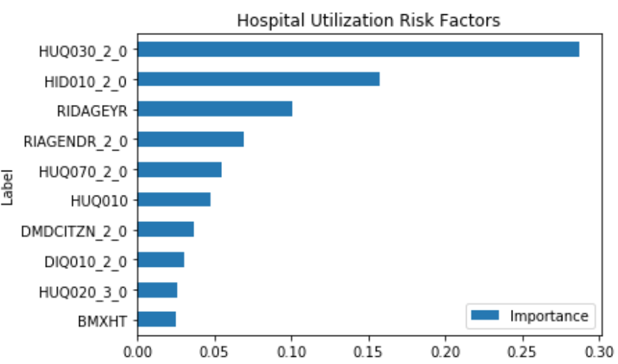  

This shows that some of the important risk factors for hospital utilization are: 
1.  HUQ030\_2.0– Routine place to go for healthcare (0 – Yes, 1 - No)
2.  HID010\_2.0 – Covered by health insurance (0 – Yes, 1 - No)
3.  RIAGENDR\_2.0 – Male or Female (1 – Female)
4.  RIDAGEYR – Age at screening
5.  DMDCITZN\_2.0 – Not a citizen of the U.S. (1 – Not a Citizen)

**Prevalence of Risk Factors:**  
The prevalence of Hospital Utiliztaion and its risk factors are depicted visually using ggplot2 in R.  

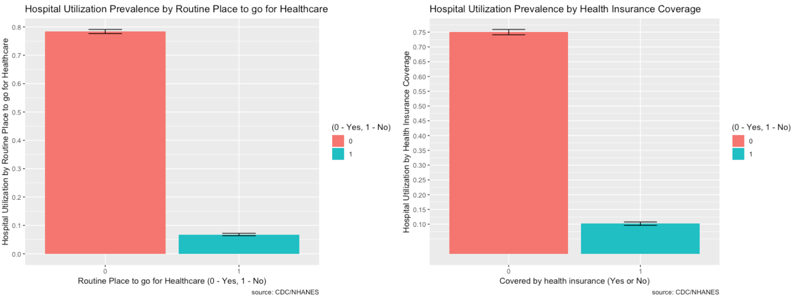  
* Most people do have healthcare, are covered by health insurance, and are U.S. citizens so the proportions are higher, but the minority does seem relatively high for each.  

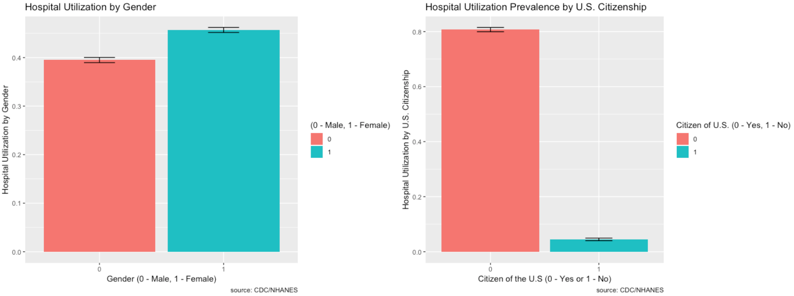  
* Females tend to go to the hospital more so than males.  

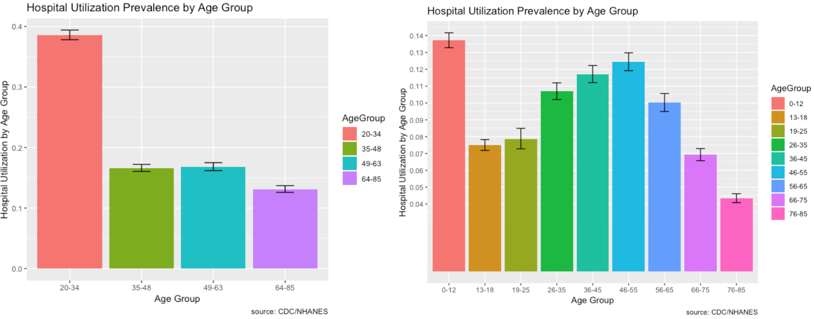  
* As we further break down the age grouping, it shows that children 0 - 12 go to the hospital a lot and this makes sense. Young children are likely to get sick from school or go to the hospital for vaccines.

**Hospital Utilization over Time:**  

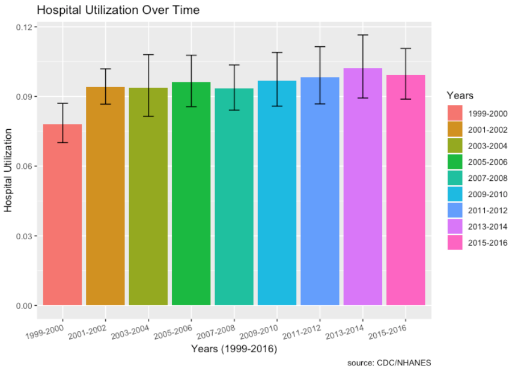  

* From 1999, there does seem to be a very slight increase in hospital utilization over time. The lowest was in 1999-2000 and the highest was most recently in 2013-2014.  

## Major Diseases: Part 2 to Part 5  
Question 2: Are there different risk factors associated with different clinical categories or clusters of patients?  
Question 3: How can the prevalence of major diseases and risk factors be depicted visually to policy makers?  
Question 4: The prevalence of certain diseases has been thought to be increasing over time. As disease prevalence increases, has the use of hospital resources also increased? Additionally, what socio-economic factors are associated with increases in disease prevalence?

### Part 2: Heart Disease  
To see different risk factors associated with heart disease, the label ‘MCQ160C’ is used in the MCQ – Medical Questionnaire file. This label indicates if “You were ever told you had coronary heart disease”.
* Mapped the classes to 0 – No Heart Disease (Majority) and 1 – Heart Disease (Minority). 
* There are 14,784 records with 65 features and ~4% are in the minority class (Heart Disease).  

**Random Forest:**  

Hyperparameters:
* Class\_weight hyperparameter was heavily weighted towards the minority class for the regular and downsampled data. 
* The upsampled data required a larger max\_depth at 15, since it has more data. 

F1 Score:
* Regular data produced the best F1 Score on minority class (Heart Disease)
    - F1 Score: 0.30
    - Precision: 0.20
    - Recall: 0.59 

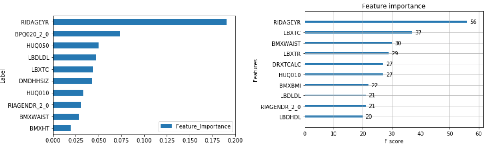  

**XGBoost:**  

Hyperparameters:  
* Scale\_pos\_weight hyperparameter was weighted towards the minority class with a value of 10 for the regular and downsampled data. 
* The upsampled data required a larger max\_depth at 6 compared to 3 since it has more data.  

F1 Score:
* Regular data produced the best F1 Score on minority class (Heart Disease)
    - F1 Score: 0.32
    - Precision: 0.22
    - Recall: 0.61

**XGBoost versus Random Forest:**
* The max depth of the trees is much less than random forest at 6 vs 15 for the upsample.  
* XGBoost improved f1-score by .02 for the minority class by improving precision and recall by 0.02 for the minority class.  
* XGBoost performs better!  

**Risk Factors:**  
The following combines the weighted feature importance of the algorithms to identify the risk factors of heart disease.  

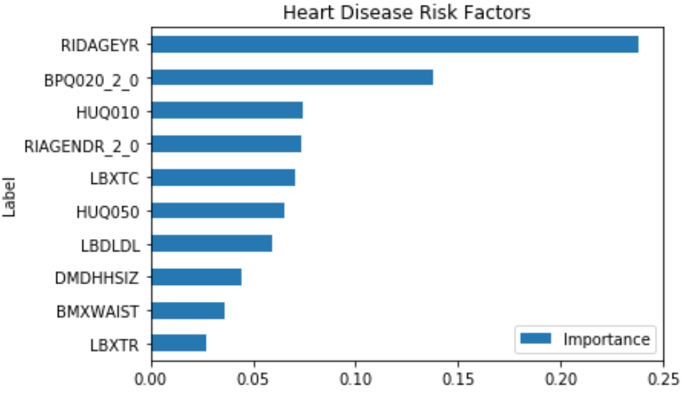  

This shows that some of the important risk factors for Heart Disease are: 
1.  RIDAGEYR – Age at Screening
2.  BPQ020_2.0 – Ever told you had high blood pressure (0 – Yes, 1 – No)
3.  RIAGENDR_2.0 – Male or Female (1 – Female)
4.  LBXTC – Total cholesterol (mg/dL)
5.  LBDLDL – LDL-cholesterol (mg/dL)  

Some of the features like HUQ010 (General health Condition) and HUQ050 (# Time Received Healthcare) are a result of the disease, so it’s not considered.

**Prevalence of Risk Factors:**  
The prevalence of Heart Disease and its risk factors are depicted visually using ggplot2 in R.  

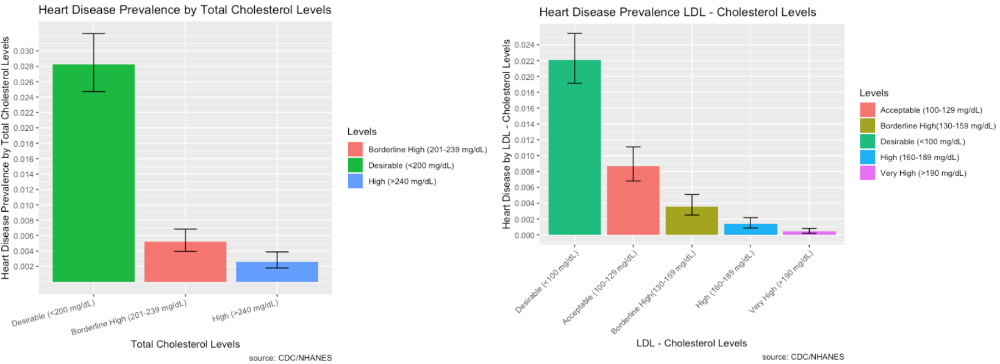  
* Most people who identified as having heart disease did have desirable total cholesterol and LDL cholesterol levels. However, high total cholesterol and LDL levels are still a good indicator of heart disease. 

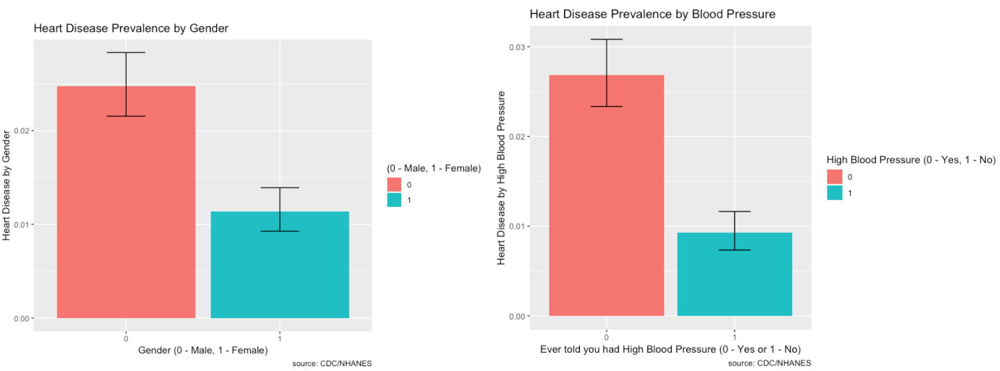  
* There is more prevalence of heart disease in males than females. Those who do have high blood pressure also make up a large proportion of people who have heart disease.

  
* Those most affected by heart disease are within the 64-85 age range group. As we break it down further, 66-75 year old’s within that group are most affected.

**Heart Disease and Hospital Utilization over Time:**  

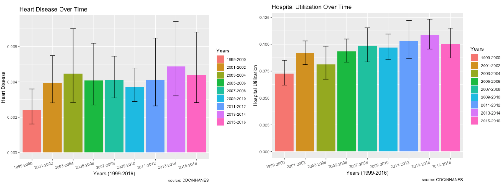  

* Heart disease doesn’t seem to be increasing over time. 
* Hospital utilization linked with those who responded to the MEC questionnaire seem to indicate an increase.  

<!-- ################################################################## -->

### Part 3: Cancer  
To see different risk factors associated with cancer, the label ‘MCQ220’ is used in the MCQ – Medical Questionnaire file. This label indicates if “You were ever told you had cancer or malignancy”. 
* Mapped the classes to 0 – No Cancer (Majority) and 1 -  Cancer (Minority).
* There are 33,074 records with 59 features and ~9% are in the minority class (Cancer).

**Random Forest:**  

Hyperparameters:
* Class\_weight hyperparameter was heavily weighted towards the minority class for the regular and downsampled data {0: 0.1, 1: 0.9}. 
* The upsampled data required a larger max\_depth at 15, since it has more data. 

F1 Score:
* Regular data produced the best F1 Score on minority class (Cancer)
    - F1 Score: 0.36
    - Precision: 0.24
    - Recall: 0.66  

A cutoff of 0.55 instead of 0.50 for classification actually improved the f1-score of both classes by 0.02.

The output of feature importance for Random Forest (Left) and XGBoost (Right):  

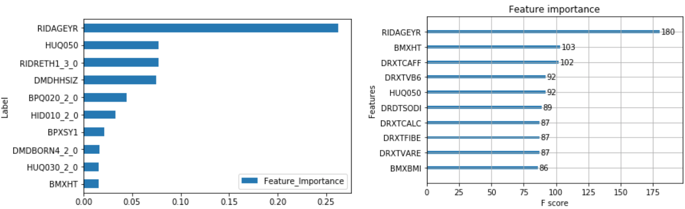  

**XGBoost:**  

Hyperparameters:  
* Scale\_pos\_weight hyperparameter was weighted towards the minority class with a value of 8 for the regular and downsampled data. 
* The upsampled data required a larger max\_depth at 6 compared to 4 since it has more data.  

F1 Score:
* Regular data produced the best F1 Score on minority class (Cancer)
    - F1 Score: 0.36
    - Precision: 0.25
    - Recall: 0.66

**XGBoost versus Random Forest:**
* The max depth of the trees is much less than random forest at 6 vs 15 for the upsample. 
* XGBoost had the same f1-score for the minority class and only improved precision of the minority class slightly by 0.01. 

**Risk Factors:**  
The following combines the weighted feature importance of the algorithms to identify the risk factors of cancer.

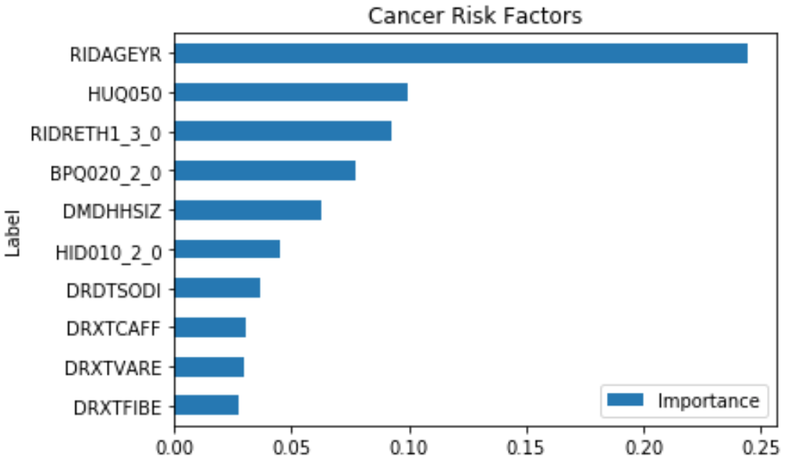  

This shows that some of the important risk factors for cancer are: 
1.  RIDAGEYR – Age at Screening
2.  RIDRETH1_3.0 – Non-Hispanic White (0 – Yes, 1 – No)
3.  BPQ020_2.0 – Ever told you had high blood pressure (0 – Yes, 1 – No)
4.  HID010_2.0 – Covered by health insurance (0 – Yes, 1 - No)
5.  DMDHHSIZ – Number of people in the household (1 to 7 or more)

Some of the features like HUQ050 (# Time Received Healthcare) is a result of the disease, so it’s not considered.

**Prevalence of Risk Factors:**  
The prevalence of Cancer and its risk factors are depicted visually using ggplot2 in R.

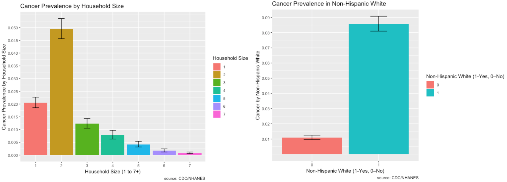  
* There is higher prevalence of cancer for non-Hispanic whites 
* There is higher prevalence of cancer in households with two members. The higher prevalence of cancer for two household members may be due to the fact that average household size is about 2.6 people.

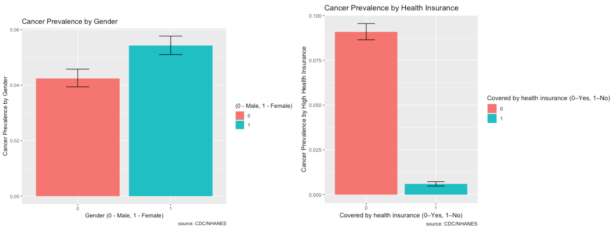  
* There is higher prevalence of cancer in women than in men.

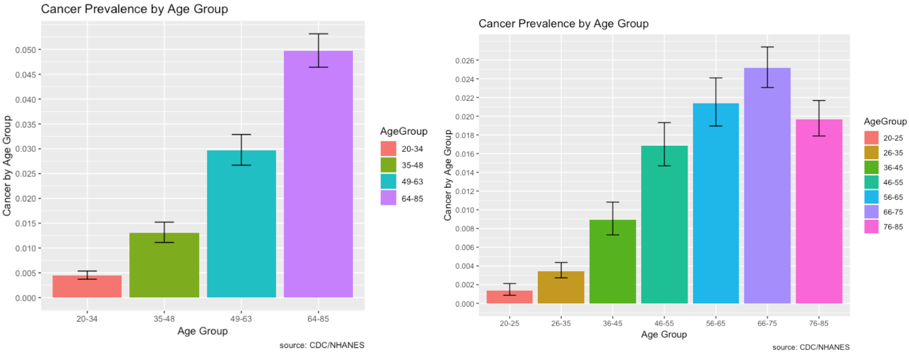  
* Cancer affects mostly older individuals over the age of 64, more specifically, 66 to 75 years of age.

**Cancer, Hospital Utilization & Proportion of No Healthcare Access over Time:**  

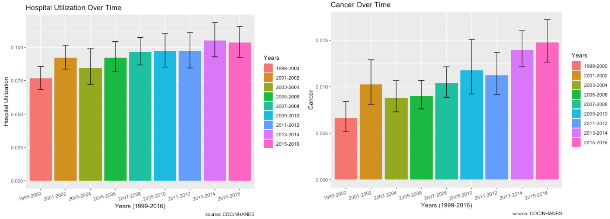  

* The plot of cancer over time shows that the prevalence is increasing. 
* Among those who responded to the cancer questionnaire, there is an increase in hospital utilization, especially from 2009 to 2016, with the highest in 2016. 

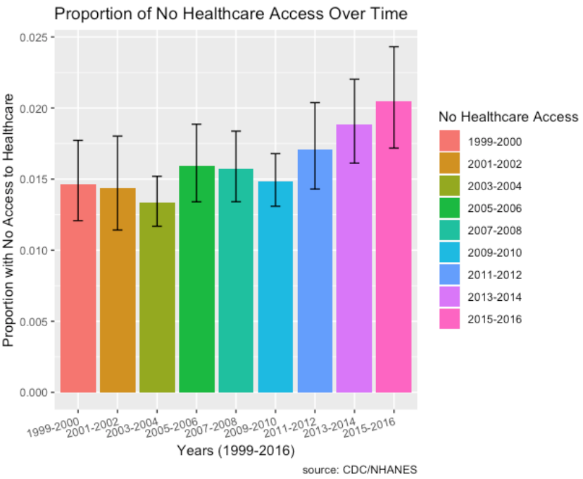  

* Socio-economic factors such as proportion of individuals with no healthcare access who have cancer has increased over the time period from 2011 to 2016 as well. 
* Also, not shown here, but prevalence of low household income levels and low education levels have decreased over time.

### Part 4: Chronic Lung Disease  
To see different risk factors associated with Chronic Lung Disease, the label ‘MCQ160K’ is used in the MCQ – Medical Questionnaire file. This label indicates if “You were ever told you had bronchitis”.
* Mapped the classes to 0 – No Chronic Lung Disease (Majority) and 1 -  Chronic Lung Disease (Minority). 
* There are 33,009 records with 60 features and ~6% are in the minority class (Chronic Lung Disease).

**Random Forest:**  

Hyperparameters:
* Class\_weight hyperparameter was heavily weighted towards the minority class for the regular and downsampled data {0: 0.1, 1: 0.9}. 
* The upsampled data required a larger max\_depth at 15, since it has more balanced data.

F1 Score:
* Regular data produced the best F1 Score on minority class (Chronic Lung Disease)
    - F1 Score: 0.31
    - Precision: 0.28
    - Recall: 0.36  

Changing cutoffs for probabilities did not improve the f1-score.

The output of feature importance for Random Forest (Left) and XGBoost (Right):  

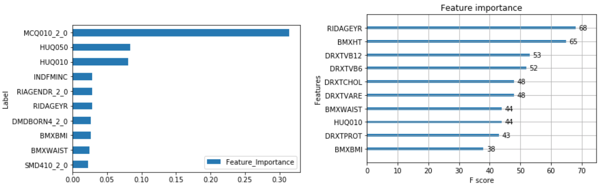  

**XGBoost:**  

Hyperparameters:  
* Scale\_pos\_weight hyperparameter was weighted towards the minority class with a value of 8 for the regular and downsampled data. 
* The upsampled data required a larger max\_depth at 6 compared to 3 since it has more balanced data.

F1 Score:
* Regular data produced the best F1 Score on minority class (Chronic Lung Disease)
    - F1 Score: 0.31
    - Precision: 0.23
    - Recall: 0.45

**XGBoost versus Random Forest:**
* The max depth of the trees is much less than random forest at 6 vs 15. 
* XGBoost had the same f1-score for the minority class and improved recall by 0.09, but did worse in precision by 0.05. 

**Risk Factors:**  
The following combines the weighted feature importance of the algorithms to identify the risk factors of Chronic Lung Disease.

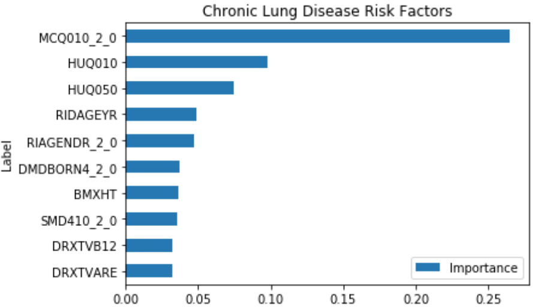  

This shows that some of the important risk factors for Chronic Lung Disease are: 
1.  MCQ010_2.0 – Ever been told you have asthma
2.  RIDAGEYR – Age at Screening
3.  RIAGENDR_2.0 – Male or Female (1 – Female)
4.  DMDBORN4_2.0 – Country of birth (1 – Other, 0 – U.S.)
5.  SMD410_2.0 – Does anyone smoke in the home? (0-Yes, 1-No)

Some of the features like HUQ010 (General health Condition) and HUQ050 (# Time Received Healthcare) are a result of the disease, so it’s not considered.

**Prevalence of Risk Factors:**  
The prevalence of Chronic Lung Disease and its risk factors are depicted visually using ggplot2 in R.

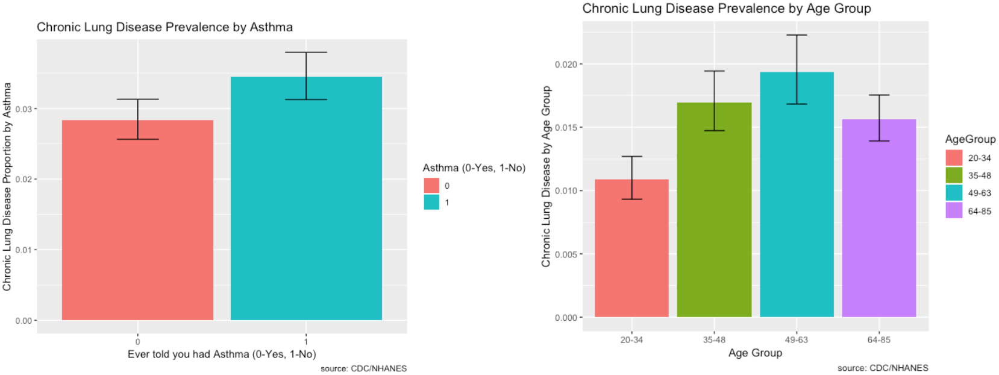  
* The prevalence of chronic lung disease for those with asthma is higher compared to those without. That could be a reason why it’s number one in feature importance.
* Chronic lung disease primarily affects individuals between the ages of 49 to 63.

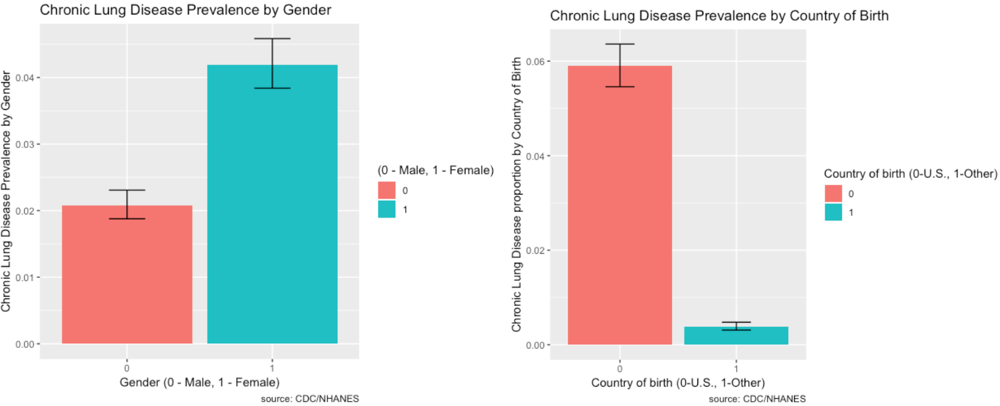  
* Females are more likely to be affected by chronic lung disease than males. 

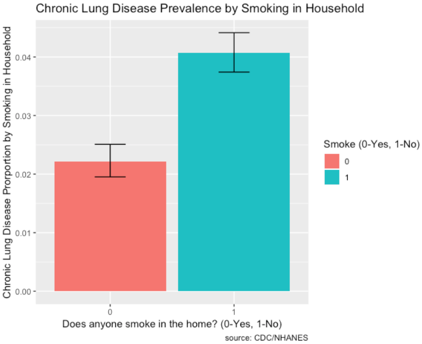  
* The prevalence of chronic lung disease for those with smoking in the household is very high compared to those without.

**Chronic Lung Disease Over Time:**  

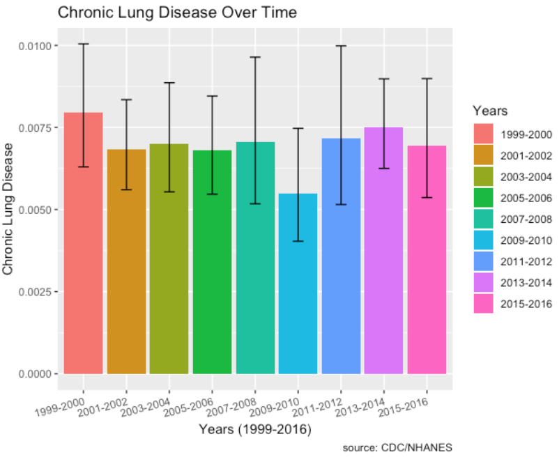  

* There doesn’t seem to be any upward or downward trend in chronic lung disease over time. 

  

* Socio-economic factors such as proportion of individuals with no healthcare access who have chronic lung disease has increased over the time period from 2011 to 2016 as well. 
* Also, not shown here, but prevalence of low household income levels and low education levels have decreased over time.

### Part 5: Diabetes  
To see different risk factors associated with Diabetes, the label ‘DIQ010’ is used in the DIQ – Diabetes Questionnaire file. This label indicates if “Doctor told you have diabetes”. 
* Mapped the classes to 0 – No Diabetes (Majority) and 1 -  Diabetes (Minority).
* There are 15,105 records with 61 features and ~12% are in the minority class (Diabetes).

**Random Forest:**  

Hyperparameters:
* Class\_weight hyperparameter was heavily weighted towards the minority class for the regular and downsampled data. 
* The upsampled data required a larger max\_depth at 15, since it has more balanced data.

F1 Score:
* Regular data produced the best F1 Score on minority class (Diabetes)
    - F1 Score: 0.47
    - Precision: 0.36
    - Recall: 0.67  

Changing cutoffs for probabilities did not improve the f1-score.

The output of feature importance for Random Forest (Left) and XGBoost (Right):  

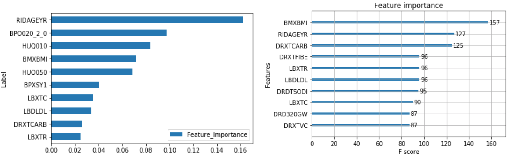  

**XGBoost:**  

Hyperparameters:  
* Scale\_pos\_weight hyperparameter was weighted towards the minority class with a value of 8 for the regular and downsampled data. 
* The upsampled data required a larger max\_depth at 6 compared to 4 since it  more balanced data.

F1 Score:
* Regular data produced the best F1 Score on minority class (Diabetes)
    - F1 Score: 0.49
    - Precision: 0.38
    - Recall: 0.71

**XGBoost versus Random Forest:**
* The max depth of the trees is much less than random forest at 6 vs 15 and 4 vs 8 for regular and downsampled.  
* XGBoost improved f1-score of the minority class by 0.02 by increasing precision by 0.02 and recall by 0.04.
* XGBoost performs better!

**Risk Factors:**  
The following combines the weighted feature importance of the algorithms to identify the risk factors of Diabetes.

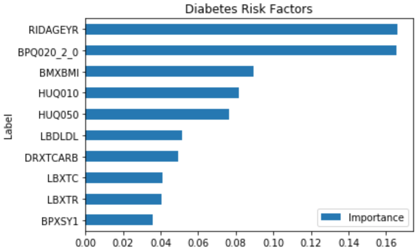  

This shows that some of the important risk factors for Diabetes are: 
1.  RIDAGEYR – Age at Screening
2.  BPQ020_2.0 – Ever told you had high blood pressure (0 – Yes, 1 – No)
3.  BMXBMI – Body Mass Index
4.  LBXTC – Total cholesterol (mg/dL)

Some of the features like HUQ010 (General health Condition) and HUQ050 (# Time Received Healthcare) are a result of the disease, so it’s not considered.

**Prevalence of Risk Factors:**  
The prevalence of Diabetes and its risk factors are depicted visually using ggplot2 in R.

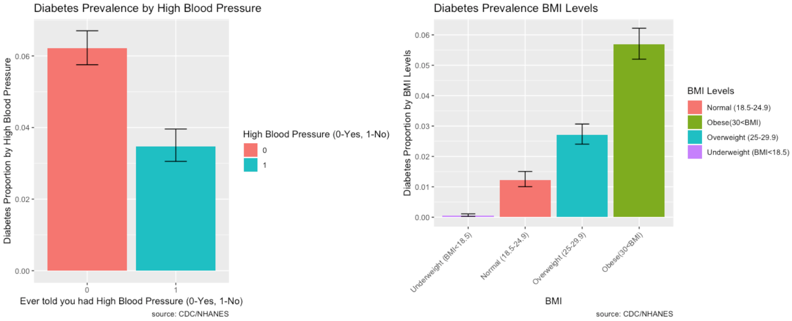  
* Those who have high blood pressure also have a high prevalence of diabetes.
* As Body Mass Index increases, the prevalence of Diabetes increases substantially. BMI is highly correlated to diabetes. 

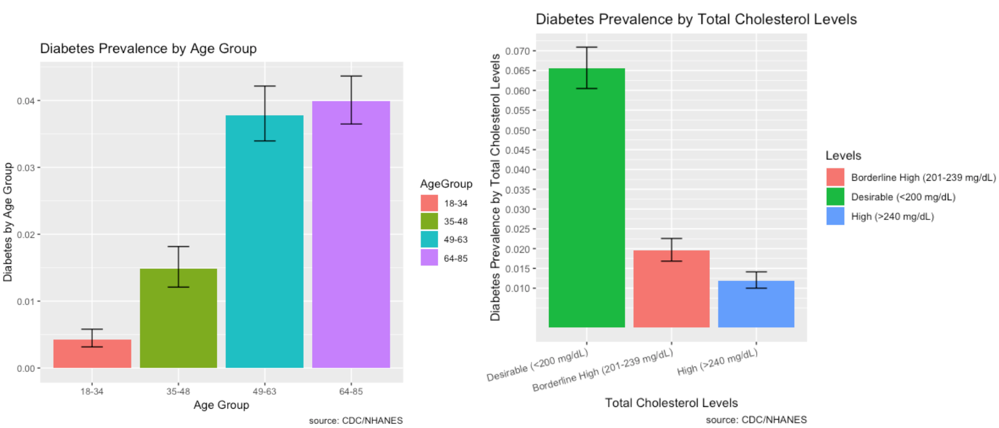  
* Diabetes is prevalent among individuals ages 49 and over. 
* Most individuals who have diabetes have desirable total cholesterol levels.

**Diabetes, Hospital Utilization and Proportion of No Healthcare Access Over Time:**  

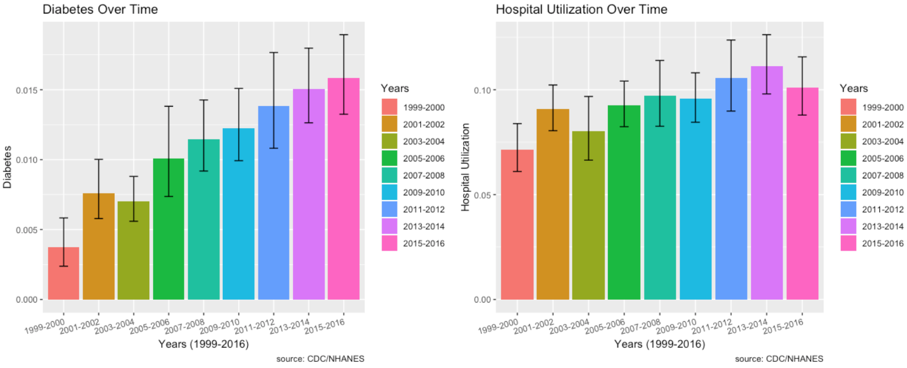  

* Diabetes has an increasing trend every single year from 2003 and onwards.  
* Hospital utilization has increased for those who answered the diabetes questionnaire. 

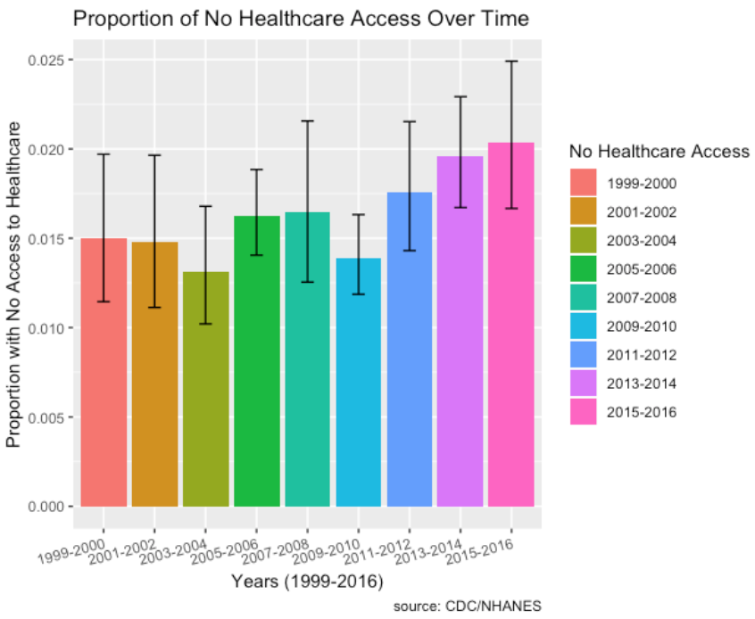  

* Socio-economic factors such as proportion of individuals with no healthcare access who have diabetes has increased over the time period from 2011 to 2016 as well.  
* Also, not shown here, but prevalence of low household income levels and low education levels have decreased over time.

## Undiagnosed Diseases
### Part 6: Undiagnosed Diabetes (BMI > 30)  
Question 5: Has the prevalence of undiagnosed conditions increased in rural populations over time, compared to non-rural populations?  

From Part 5, since BMI levels are highly correlated to risk of diabetes, I will use BMI levels to visualize and see whether the prevalence of undiagnosed diabetes has increased in rural populations over time compared to non-rural populations.  
Individuals who have BMI levels greater than 30 are considered to have diabetes. I created a new column in my data with a value of “Undiagnosed Diabetes” or “Not Undiagnosed”. An individual who is coded “Undiagnosed Diabetes” has a value of 0 for DIQ010, indicating no doctor told them they have diabetes, and they also have a value >30 for BMXBMI. The graph below shows the error box plots of the interaction and prevalence between “Undiagnosed Diabetes” and “Year” over time from 1999 to 2016. 

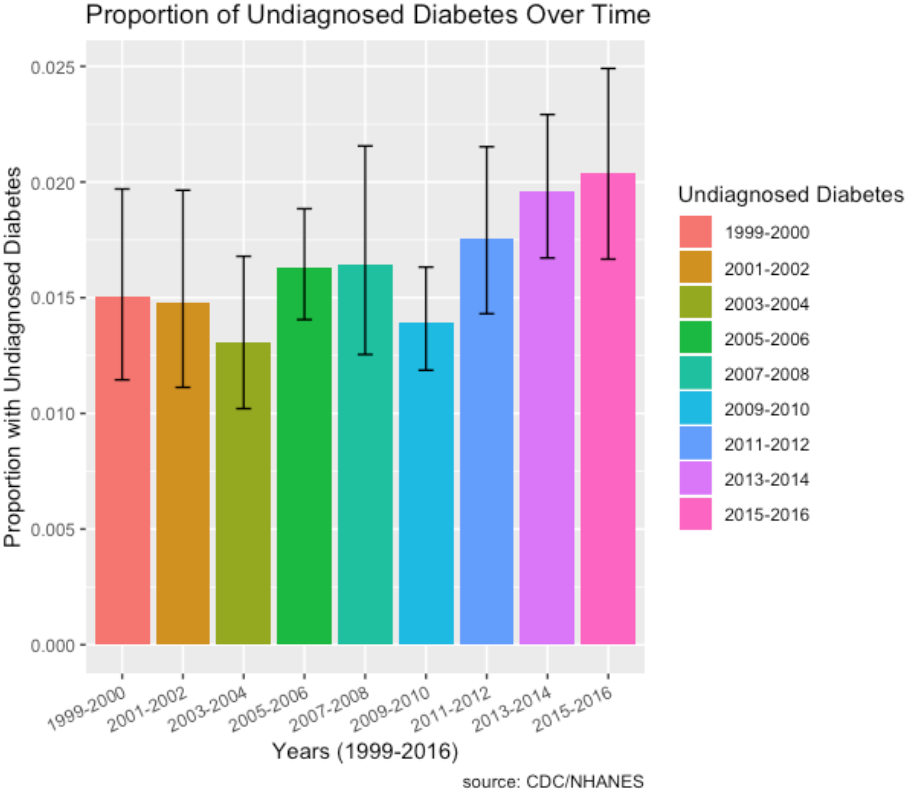  

The plot shows that the prevalence of undiagnosed diabetes has indeed increased over time.  

## Conclusion:  

**Hospital Utilization**
* Hospital utilization overall hasn’t increased much over time, but for individuals who responded to the cancer and diabetes questionnaire, hospital utilization has increased. Hospital utilization for those who have heart disease seems to have increased slightly.

Age is a huge factor in determining hospital utilization and risk of major diseases.  

**Major Diseases:**  

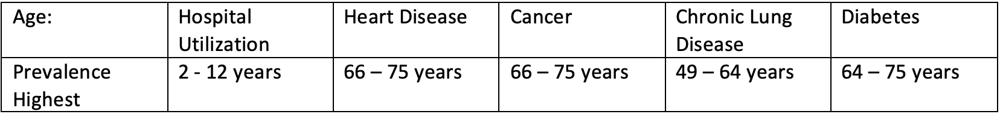  

**Heart Disease**  
* Risk factors include age, blood pressure, gender, and cholesterol.  
* Prevalence of heart disease is high in individuals with desirable levels of cholesterol, so there may be some undiagnosed individuals. 
* Heart disease is more prevalent in males and those with high blood pressure. 
* Heart disease prevalence isn’t increasing over time.

**Cancer**  
* Risk factors include gender, being a non-Hispanic white, household size, and age.  
* Being female, having a household size of two, and non-Hispanic whites are indicative of a high prevalence of cancer.
* The prevalence of cancer is increasing a lot over time. 
    * For individuals who repsonded to the cancer questionnaire, hospital utilization has also increased.

**Chronic Lung Disease**  
* Risk factors include asthma, age, gender, and smoking. 
* Prevalence is high for people with asthma and it’s almost double for females compared to males. 
* The prevalence of chronic lung disease isn’t increasing over time.

**Diabetes**  
* Risk factors for diabetes include body mass index, age, blood pressure, and cholesterol. 
* High body mass index is highly correlated to diabetes. 
* High blood pressure is also a good indicator of diabetes.
* The prevalence of diabetes is increasing a lot over time.  
    * For individuals who repsonded to the diabetes questionnaire, hospital utilization has also increased over time.

**Socio-economic Factors**  
* Socio-economic factors such as proportion of individuals with no healthcare access who have diabetes and chronic lung disease have increased over the time period from 2011 to 2016 as well.  
* Also, not shown here, but prevalence of low household income levels and low education levels have actually decreased over time.

